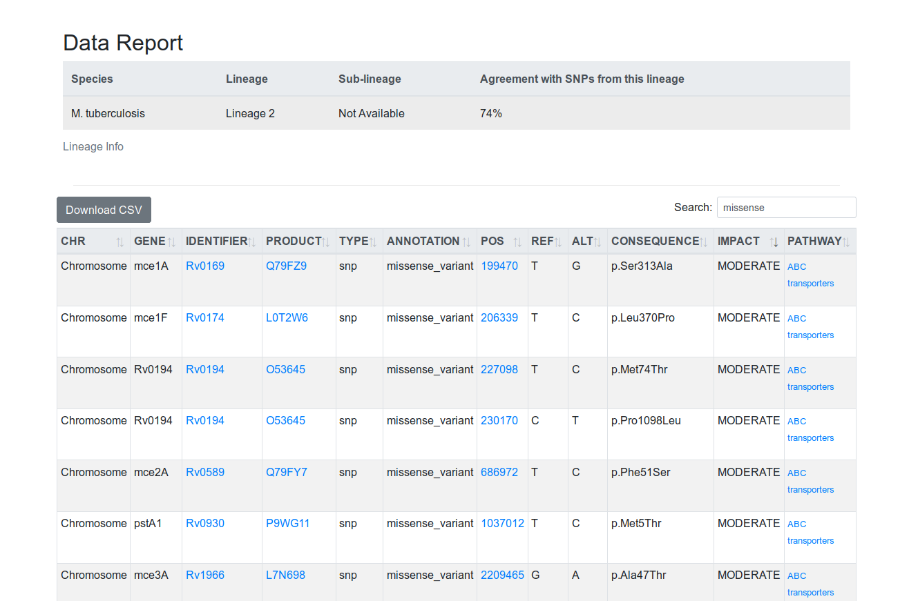
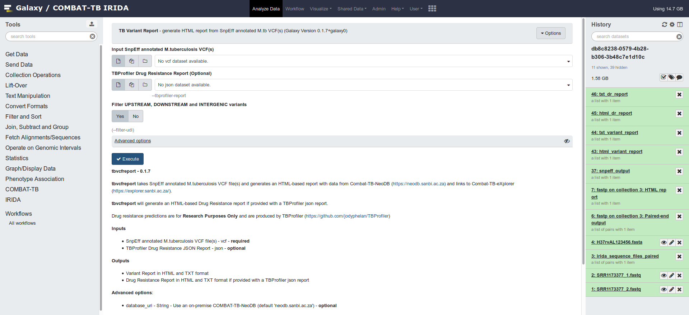

# **tbvcfreport**

[](https://travis-ci.org/COMBAT-TB/tbvcfreport)
[](https://anaconda.org/thoba/tbvcfreport)
[](http://bioconda.github.io/recipes/tbvcfreport/README.html)

Generate an interactive HTML-based report from *M.tb* SnpEff annotated VCF(s) with links to the [COMBAT-TB-eXplorer](https://explorer.sanbi.ac.za/).



## Usage

**Prerequisites:**

- [SnpEff](http://snpeff.sourceforge.net/SnpEff_manual.html) annotated *M.tuberculosis* VCF file(s).

**Optional:**
- A [COMBAT-TB-NeoDB](https://github.com/COMBAT-TB/combat-tb-neodb) instance, `tbvcfreport` defaults to [neodb.sanbi.ac.za](https://neodb.sanbi.ac.za).
  - See [documentation](https://github.com/COMBAT-TB/combat-tb-neodb) if you want a local installation and `export DATABASE_URI=localhost` for `tbvcfreport` to use your local instance.

### Installation

#### Using `pip`

```sh
$ pip install -i https://test.pypi.org/simple/ tbvcfreport
...
```

#### Using `conda`

With an activated [Bioconda](https://bioconda.github.io/) channel:

```sh
$ conda install tbvcfreport
...
```

#### From source

```sh
$ git clone https://github.com/COMBAT-TB/tbvcfreport.git
...
$ cd tbvcfreport
$ virtualenv envname
$ source envname/bin/activate
$ pip install -r requirements.txt
$ pip install -e .
```

### Run `tbvcfreport`

```sh
$ tbvcfreport --help
Usage: tbvcfreport [OPTIONS] COMMAND [ARGS]...

  Generate an HTML-based VCF report from SnpEff annotated VCF file(s).

Options:
  --help  Show this message and exit.

Commands:
  generate  Generate an interactive HTML-based VCF report.

```

```sh
$ tbvcfreport generate --help
Usage: tbvcfreport generate [OPTIONS] VCF_DIR

  Generate an interactive HTML-based VCF report.

Options:
  -t, --tbprofiler-report FILENAME
                                  TBProfiler json report.
  -f, --filter-udi / -nf, --no-filter-udi
                                  Filter upstream, downstream and intergenic
                                  variants.  [default: True]
  --help                          Show this message and exit.

```

```sh
$ tbvcfreport generate VCF_DIR/
Processing...
```

This will generate a `{vcf-file-name}.html` file in the current working directory (`pwd`).

## In Galaxy

We have also added `tbvcfreport` to the [Galaxy](https://github.com/galaxyproject) [Tool Shed](https://toolshed.g2.bx.psu.edu/repository?repository_id=47a4512ab5a77049).

Kindly see [`this repository`](https://toolshed.g2.bx.psu.edu/repository?repository_id=47a4512ab5a77049) for the latest revision.


